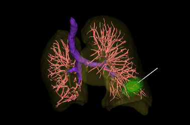
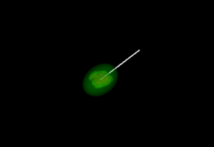

# Pulmonary Nodule Ablation Path Planning System

English | [Chinese](README_CN.md) 

This repository provides a Python and VTK-based implementation of a CT image pulmonary nodule ablation path planning system. It includes segmentation and three-dimensional reconstruction (surface rendering) of pulmonary organs (lungs, bones, trachea, blood vessels) and pulmonary nodules, microwave ablation needle route planning algorithm, microwave ablation temperature field simulation algorithm, and post-ablation evaluation.

#### ⚠️ This project is currently paused for maintenance. The project is still at an early stage and has many shortcomings. Feel free to raise issues, and further improvements may be made depending on circumstances (maybe...).

<div align="center">
  
</div>
<div align="center">
  
</div>
<div align="center">
  
</div>
<div align="center">
  
</div>

# Project Structure
- doc
    - img: `images`
- src
    - main_window.py: `Implementation of main window functionality`
    - mouse_interactor_style.py: `Mouse interaction events`
    - seg.py: `Segmentation algorithm`
- ui
    - path_planning.ui: `Interface file`
    - ui.py: `Interface code`
- utils
    - dcm2nii.py: `DICOM to NIFTI conversion`
    - dilate.py: `Morphological operations`
    - eval_tumor_efficacy.py: `Post-ablation evaluation`
    - extract_point.py: `Point set extraction`
    - is_pareto_front.py: `Pareto front determination`
    - kmeans.py: `Clustering algorithm`
    - mc.py: `Surface rendering algorithm`
    - path_design.py: `Path planning algorithm`
    - power_time.py: `Ablation time-power algorithm`
    - reader.py: `File reading`
    - resample.py: `Resampling`
- main.py: `Main function entry point`
- main.spec: `Packaging configuration`
- README.md: `Readme file`
- requirements.txt: `Dependency list`

# Getting Started

1. Make sure you have installed the required libraries:

```
pip install -r requirements.txt
```

2. nnUNet Configuration:

Refer to the [official repository](https://github.com/MIC-DKFZ/nnUNet) for nnUNet setup and place the nnUNet code repository in the main directory.

3. Run:

```
python main.py
```

# Friendly Link
[Lung Organ Segmentation: A Comprehensive Python Project](https://github.com/skyous779/Lung-Organ-Segmentation)

# Disclaimer:
- **For learning and research purposes only:** This project is intended for learning and research purposes only. The developers are not responsible for any consequences arising from illegal use.

- **No medical advice provided:** Any information in this project should not be considered medical advice. Consult a professional doctor before making any medical decisions.